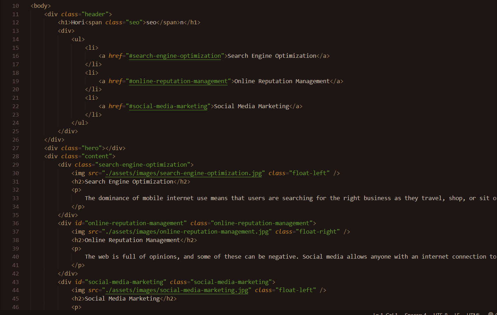
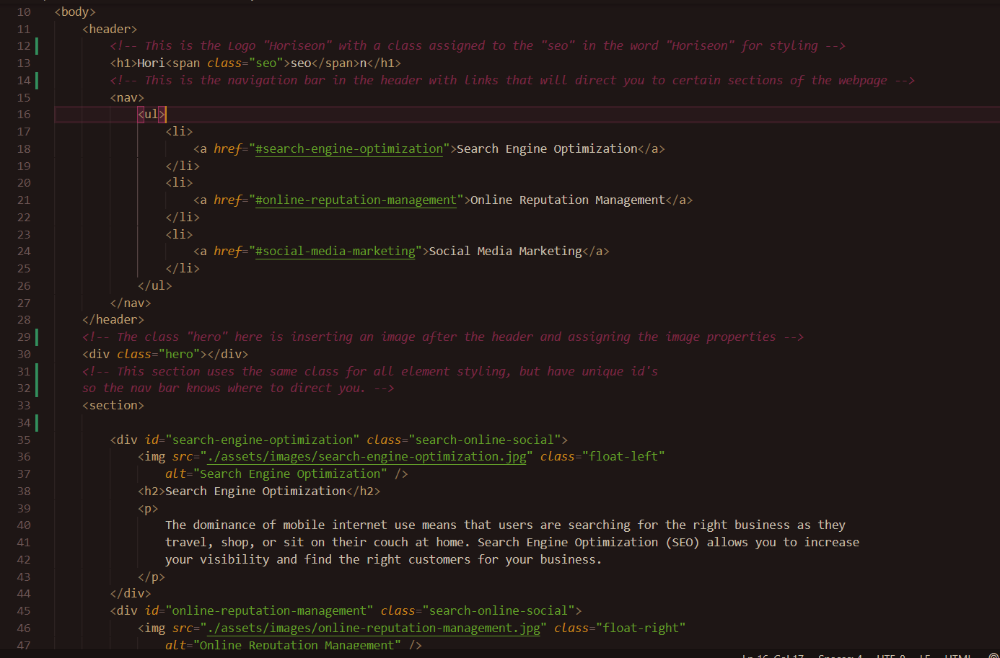

# Homework-1 Code Refactor
## Horiseon Webpage 
### For this Homework assignment I recieved source code for Horiseon's webpage.  The code I recieved had no comments, lacked accessibility standards, and had excess code that could be condensed.
 

### Even though the code functioned properly,  it needed to be cleaned up. After refactoring the source code given to me, readability and accessibility has been improved while keeping the original code's functionality.
